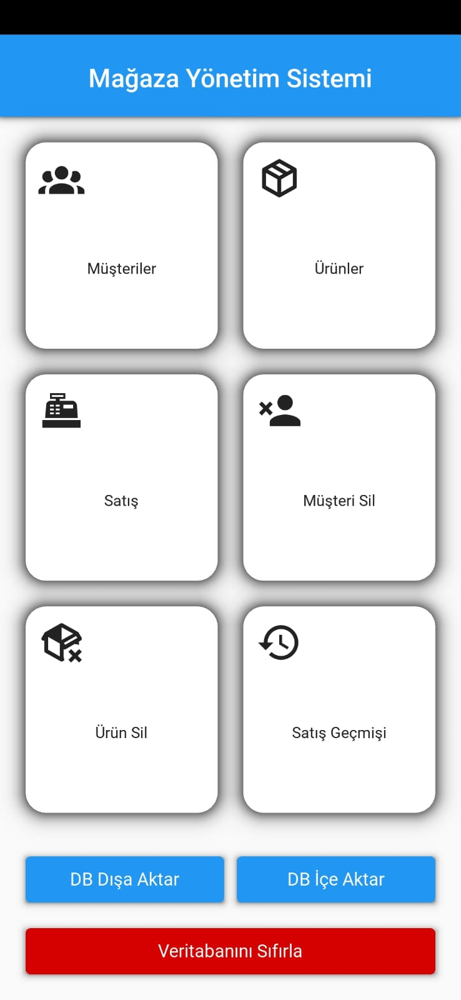
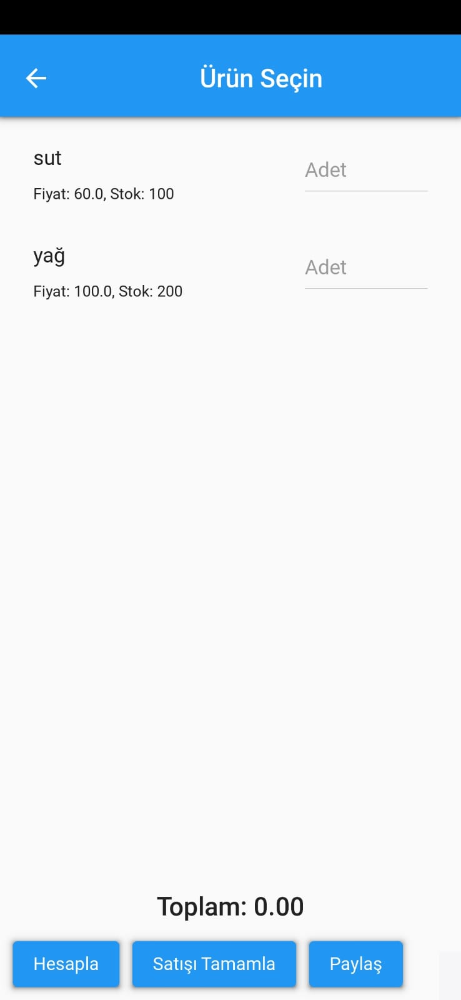
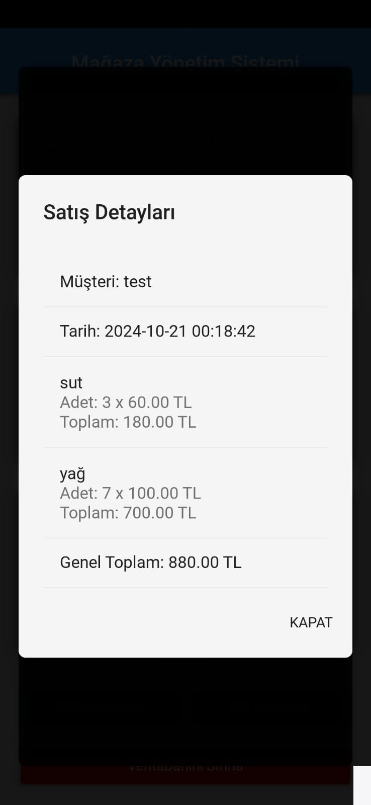
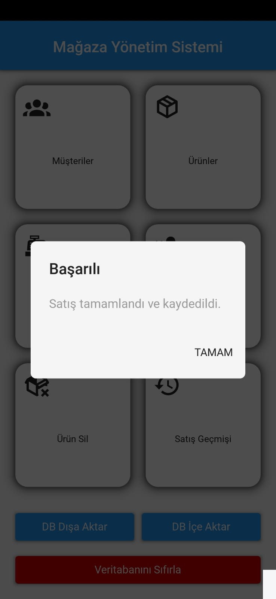
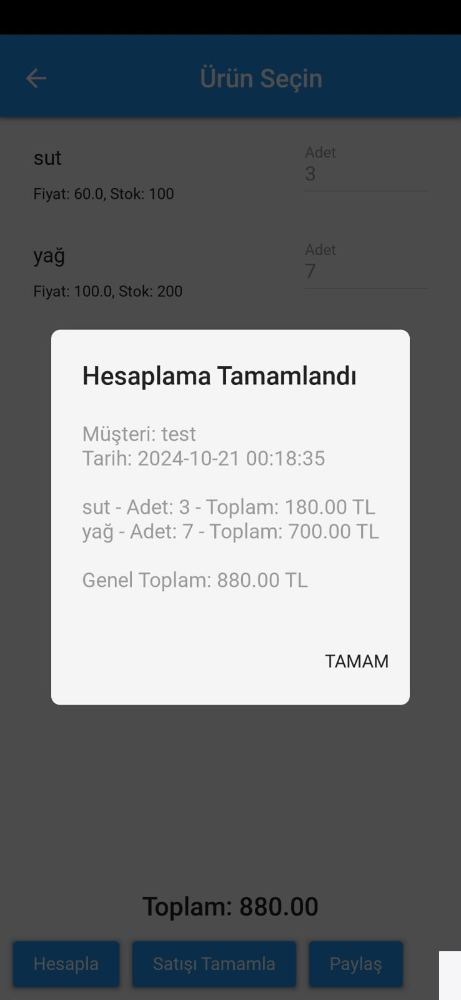
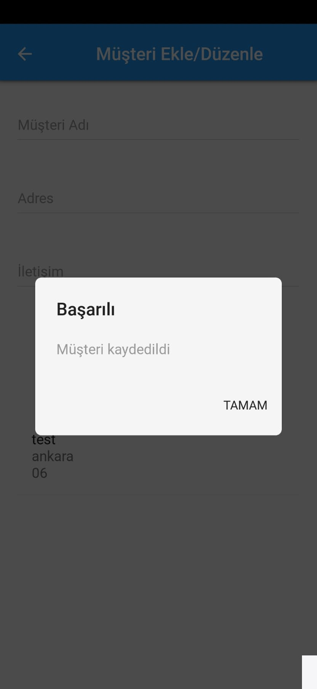
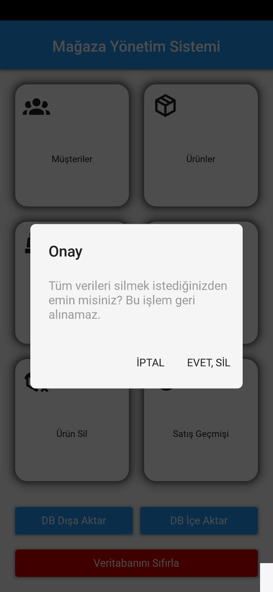
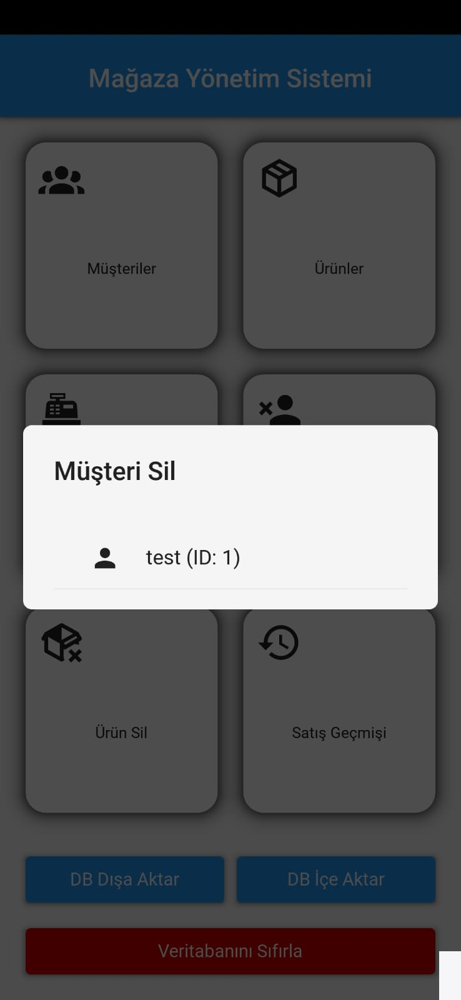
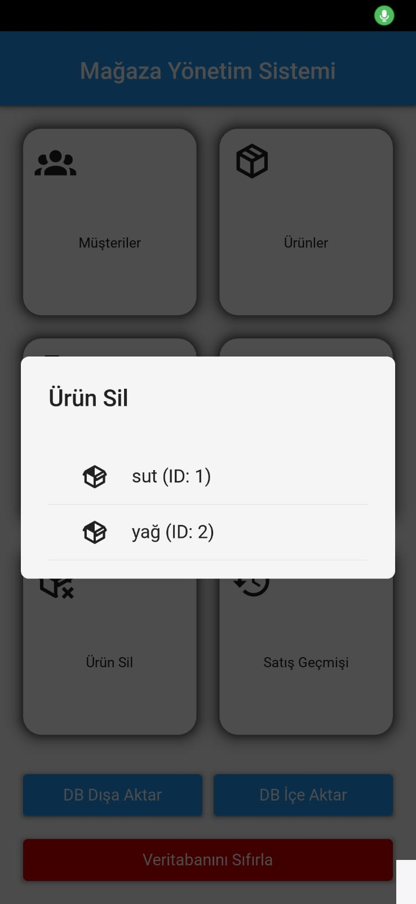

# Store Management System

## Overview

This project is a **Store Management System** developed using **Python Kivy**. The primary goal of this project is educational, serving as an example for those looking to learn about mobile application development with Python. The system provides basic functionalities to manage customers, products, and sales records, demonstrating key programming concepts and app structures.

## Features

- **Customer Management**: Add, edit, and delete customer information.
- **Product Management**: Add, edit, and manage product details.
- **Sales Record Keeping**: Maintain a list of sales transactions with customer and product details.
- **Database Interactions**: Basic operations to store and retrieve data from the database (planned enhancements in the next version).

## Functions and Components Used

The following key functions and components were used in this project:

1. **Python Kivy Framework**: For building the graphical user interface (GUI) and handling user interactions.
2. **SQLite Database**: To store data related to customers, products, and sales. The database interaction will be further improved in future updates.
3. **File Operations**: Exporting and sharing database files, with plans for further enhancements in future releases.
4. **Cross-Platform Compatibility**: Designed to work on Android, with platform-specific adjustments and permissions handling.
5. **Exception Handling**: Implemented to manage errors during file operations and user interactions.

## Planned Features

The current version of the application provides fundamental features. Future versions aim to improve:
- Database functionalities for better data handling and retrieval.
- More advanced customer and sales analytics.
- Enhanced user interface for a better user experience.

## Installation and Setup

To install and run the application, follow these steps:
1. Clone the repository to your local machine.
2. Make sure you have Python and Kivy installed.
3. Build the APK using Buildozer for Android devices.

## Contribution

As this is an educational project, contributions are welcome! Feel free to fork the repository, suggest improvements, or report issues.

## Screenshots

Here are some screenshots from the application:

1. 
2. 
3. 
4. 
5. 
6. 
7. 
8. 
9. 
10. 

---

# Mağaza Yönetim Sistemi

## Genel Bakış

Bu proje, **Python Kivy** kullanılarak geliştirilmiş bir **Mağaza Yönetim Sistemi**dir. Projenin temel hedefi eğitim amaçlıdır ve Python ile mobil uygulama geliştirmeyi öğrenmek isteyenler için bir örnek teşkil etmektedir. Sistem, müşteri, ürün ve satış kayıtlarını yönetmek için temel işlevleri sunarak, önemli programlama kavramlarını ve uygulama yapısını göstermektedir.

## Özellikler

- **Müşteri Yönetimi**: Müşteri bilgilerini ekleme, düzenleme ve silme.
- **Ürün Yönetimi**: Ürün detaylarını ekleme, düzenleme ve yönetme.
- **Satış Kaydı Tutma**: Müşteri ve ürün bilgileri ile satış işlemlerini kayıt altına alma.
- **Veritabanı Etkileşimleri**: Veritabanına veri depolama ve geri çağırma için temel işlemler (bir sonraki sürümde geliştirmeler planlanmıştır).

## Kullanılan Fonksiyonlar ve Bileşenler

Projede kullanılan temel fonksiyonlar ve bileşenler şunlardır:

1. **Python Kivy Framework**: Grafik kullanıcı arayüzü (GUI) oluşturmak ve kullanıcı etkileşimlerini yönetmek için.
2. **SQLite Veritabanı**: Müşteriler, ürünler ve satışlarla ilgili verileri depolamak için kullanılır. Gelecek güncellemelerde veritabanı etkileşimleri daha da geliştirilecektir.
3. **Dosya İşlemleri**: Veritabanı dosyalarını dışa aktarma ve paylaşma, gelecekteki sürümlerde daha fazla iyileştirme planlanmıştır.
4. **Çapraz Platform Uyumluluğu**: Android üzerinde çalışmak üzere tasarlanmış, platforma özel ayarlamalar ve izin yönetimi içerir.
5. **Hata Yönetimi**: Dosya işlemleri ve kullanıcı etkileşimleri sırasında oluşabilecek hataları yönetmek için uygulanmıştır.

## Planlanan Özellikler

Uygulamanın mevcut sürümü temel özellikler sunmaktadır. Gelecek sürümler için hedeflenen iyileştirmeler:
- Veritabanı işlevselliklerinin geliştirilmesi ve daha iyi veri yönetimi.
- Daha gelişmiş müşteri ve satış analizleri.
- Kullanıcı deneyimini geliştirmek için daha iyi bir arayüz tasarımı.

## Kurulum ve Kurulum Adımları

Uygulamayı kurmak ve çalıştırmak için aşağıdaki adımları izleyin:
1. Depoyu yerel makinenize klonlayın.
2. Python ve Kivy'nin kurulu olduğundan emin olun.
3. Android cihazlar için APK oluşturmak için Buildozer kullanın.

## Katkı

Bu proje eğitim amaçlı olduğundan, katkılara açıktır! Depoyu fork ederek geliştirme önerilerinizi iletebilir veya sorunları bildirebilirsiniz.

## Ekran Görüntüleri

Uygulamadan bazı ekran görüntüleri:

1. 
2. 
3. 
4. 
5. 
6. 
7. 
8. 
9. 
10. 